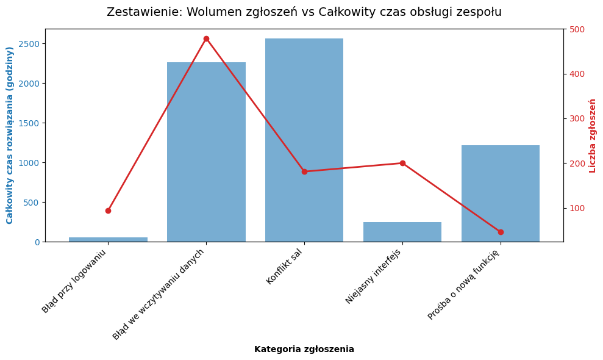

# Portfolio Analityczne: Dobry Plan

**Cel:** Symulacja pracy na stanowisku Product Analyst & Tech Support

**Metodyka:** Od diagnozy pojedynczego przypadku (skala mikro) do analizy długu operacyjnego (skala makro)

# Część 1: Skala mikro - Analiza przypadku brzegowego (Edge case)

*Ta sekcja pokazuje proces dedukcji i sposób rozwiązywania pojedynczych problemów zgłaszanych przez użytkowników*

### Zgłoszenie od klienta:

Dyrektor liceum dzwoni wzburzony: “Wasz system wygenerował plan lekcji bez najmniejszego ostrzeżenia, wszystko świeciło się na zielono. Zatwierdziliśmy go i opublikowaliśmy. Dzisiaj jednak, o 15:05 dwóch wuefistów zderzyło się w drzwiach sali gimnastycznej, bo dwie klasy zostały przypisane do tej samej salki, która mieści ledwo 30 osób. Jak algorytm mógł tego nie wyłapać!?”

### Poszukiwanie źródła problemu:

1. Weryfikacja parametrów wejściowych: szkoła poprawnie zdefiniowała limit małej sali gimnastycznej na maksymalnie 30 osób
2. Weryfikacja podziałów: Obie klasy, 2A i 2C mają WF podzielony na grupy - chłopcy i dziewczęta
3. Analiza architektury walidacji. Problem leży w pętli walidacyjnej silnika. Algorytm sprawdza warunki z perspektywy pojedynczego nauczyciela, a nie globalnego limitu pomieszczenia: 
    1. Dyrektor ustawił priorytet na ograniczanie okienek nauczycieli, a algorytm potraktował to jako wymóg, a nie priorytet. 
        1. Dla nauczyciela 1: Silnik policzył, że grupy 2A chłopcy (12 osób) i 2C chłopcy (18 osób) to łącznie 30 osób, co mieści się w ograniczeniach sali - walidacja pomyślna. 
        2. Dla nauczyciela 2: Silnik policzył, że grupy 2A dziewczęta (15 osób) i 2C dziewczęta (11 osób) to łącznie 26 osób, co również przeszło walidację. 
    2. Ponieważ oba zdarzenia niezależnie przeszły walidację, system zapisał je do bazy w tym samym czasie (czwartek 15:05) na tej samej sali, nie sumując ich po stronie zasobu (sali).

### Tymczasowe obejście problemu (Działanie wsparcia):

Z racji tego, że chaos ujawnił się na początku trwającej już lekcji, trzeba podjąć natychmiastowe działanie. Ręcznie zmieniam salę dla dziewcząt na “korytarz/boisko” i wymuszam cichą aktualizację planu z powiadomieniem na telefon dla uczniów tych konkretnych klas o zmianie miejsca zajęć na resztę półrocza, zdejmując z dyrektora konieczność ręcznego informowania rodziców.

### Rekomendacja dla programistów:

Zgłaszam krytyczny błąd logiczny. Moduł sprawdzający pojemność sal musi zostać przeniesiony o warstwę wyżej. Zamiast iterować po przypisaniach nauczycieli ( `for teacher in teachers_schedule` ), silnik przed ostatecznym wygenerowaniem planu musi zsumować wszystkie rekordy wejściowe w ogólnym ujęciu: pogrupować plan po `classroom_id` oraz `lesson_start_time`, zsumować `students_count` i dopiero ten globalny wynik porównać z parametrem `max_capacity`.

# Część 2: Skala makro - wpływ na biznes i rozwój produktu

*Ta sekcja demonstruje, jak ręczne zgłoszenia z działu wsparcia przekładam na twarde dane, by usprawnić produkt przy użyciu środowiska Python.*

### Hipoteza badawcza:

Pojedynczy konflikt sal (opisany wyżej) jest trudny do rozwiązania, ponieważ wymaga ręcznej analizy zasobów. Jeśli ten błąd występuje masowo również w innych szkołach, wsparcie techniczne jest stale przeciążane.

## Weryfikacja danych (skrypt analityczny):

Przeprowadziłem symulację na 1000 wygenerowanych zgłoszeniach wsparcia.

*Z kodem źródłowym symulacji (Python/Pandas) można zapoznać się w pliku* `dobryplan.ipynb`

### Odkrycie analityczne:

Jak udowadnia mój skrypt, zgłoszenia typu `Konflikt sal`  powodują nieproporcjonalnie większy nakład czasowy. Mimo że stanowią zaledwie drobną część wszystkich ticketów (181 na 1000 zgłoszeń), ich obsługa jest na tyle skomplikowana, że pożera z budżetu operacyjnego ponad 2500 godzin pracy zespołu wsparcia. Dla porównania, proste błędy interfejsu to tylko 200 godzin.

### Rekomendacje:
1. **Dla zespołu IT:** Ręczne rozwiązywanie takich konfliktów na dłuższą metę nie ma sensu. Rekomenduję zmianę w algorytmie układającym. Przed ostatecznym wygenerowaniem planu, system musi sprawdzić łączną sumę uczniów przypisanych do danej sali w danym czasie. Jeśli limit miejsc w sali jest przekroczony, system powinien zablokować tę operację, nawet kosztem stworzenia "okienka" dla nauczyciela. Fizyczna pojemność budynku musi mieć wyższy priorytet.
2. **Dla Zespołu Wsparcia:** Zanim programiści wdrożą poprawkę, dział wsparcia powinien mieć gotową procedurę obchodzenia tego problemu. Kiedy dyrektor zgłasza przepełnioną salę, konsultant powinien poinstruować go, jak ręcznie przenieść jedną z klas na inne miejsce w systemie (np. "Korytarz" lub "Boisko"). To zdejmie blokadę z algorytmu i pozwoli dyrektorowi natychmiast opublikować poprawny plan dla reszty szkoły.
